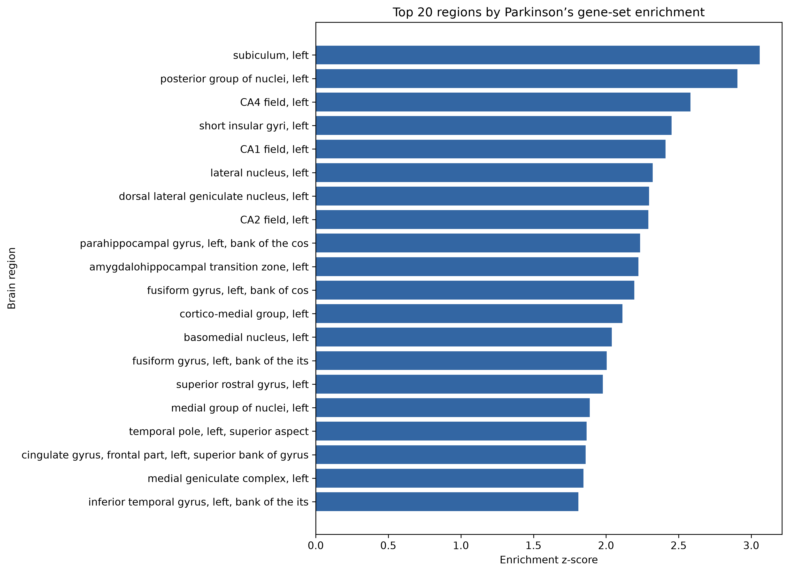
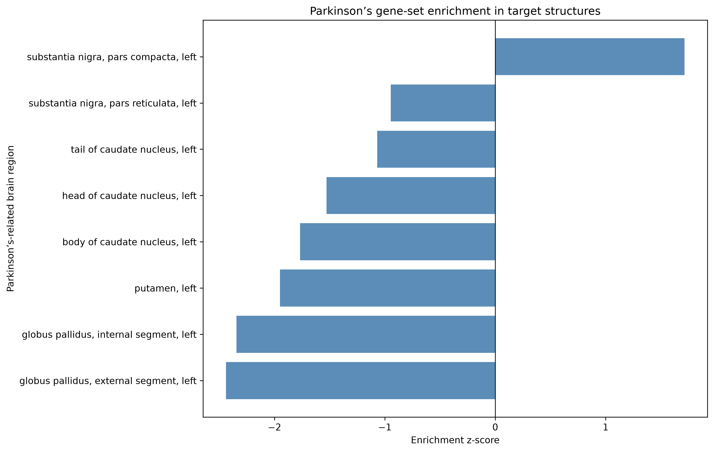
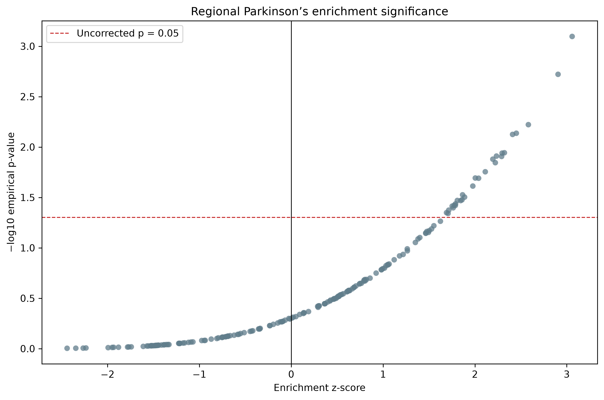
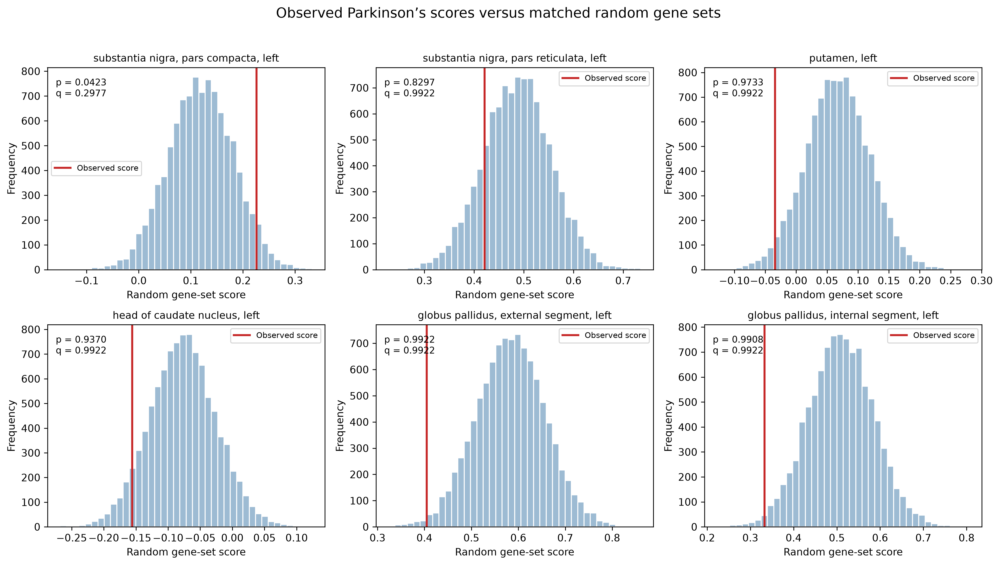
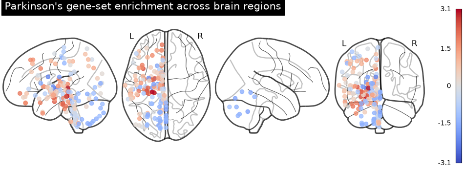
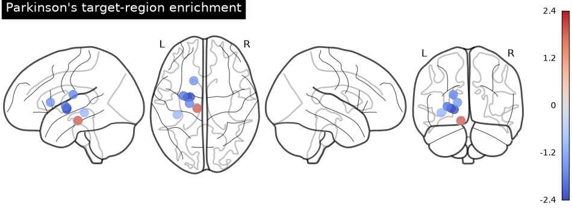

# Parkinson’s Disease Regional Gene-Expression Analysis

This project integrates Parkinson’s disease genome-wide association study (GWAS) results with regional gene-expression data from the Allen Human Brain Atlas (AHBA).

The goal is to determine whether genes associated with Parkinson’s disease show unusually high expression in specific human brain regions compared with detection-matched random gene sets.

## Research question

Do genes implicated by significant Parkinson’s disease GWAS associations show regional enrichment in anatomically relevant areas of the human brain?

Regions of particular interest include:

- Substantia nigra
- Putamen
- Caudate nucleus
- Globus pallidus

## Project overview

The analysis combines two datasets:

1. **Allen Human Brain Atlas**

   Microarray gene-expression measurements from 3,702 postmortem tissue samples collected from six adult human donors.

2. **Parkinson’s disease GWAS Catalog data**

   Published genetic associations mapped to Parkinson’s disease, including variants, p-values, mapped genes, studies, and PubMed identifiers.

The project:

- Validates all donor files
- Identifies available brain structures
- Extracts genome-wide-significant Parkinson’s GWAS genes
- Matches GWAS genes to AHBA microarray probes
- Filters probes using detection reliability
- Aggregates expression by donor and brain region
- Constructs a detection-matched background gene set
- Performs permutation-based regional enrichment testing
- Applies false-discovery-rate correction
- Runs sensitivity analyses
- Generates statistical figures and anatomical brain maps

## Main results

### Dataset summary

- 6 AHBA donors
- 3,702 tissue samples
- 414 unique brain structures
- 58,692 microarray probes per donor
- 905 Parkinson’s GWAS associations
- 587 genome-wide-significant associations at `P ≤ 5 × 10⁻⁸`
- 314 unique cleaned GWAS gene symbols
- 201 GWAS genes matched to AHBA probes
- 176 genes retained after probe-reliability filtering
- 20,598 reliable background genes
- 183 brain regions represented in at least four donors
- 10,000 detection-matched random gene-set permutations

### Primary whole-brain analysis

No brain region remained statistically significant after false-discovery-rate correction:

- Regions tested: 183
- FDR-significant regions: 0

The strongest enrichment was observed in the left subiculum:

- Enrichment z-score: `3.059`
- Empirical p-value: `0.0008`
- FDR q-value: approximately `0.084`

This result did not cross the prespecified FDR threshold of `q < 0.05`.

### Parkinson’s-related target regions

The left substantia nigra pars compacta showed nominal positive enrichment:

- Enrichment z-score: `1.715`
- Empirical p-value: `0.0423`
- Whole-brain FDR q-value: approximately `0.298`
- Target-family sensitivity q-value: approximately `0.338`

This signal is exploratory because it did not remain significant after multiple-testing correction.

Other examined Parkinson’s-related regions, including the putamen, caudate nucleus, globus pallidus, and substantia nigra pars reticulata, did not show significant positive enrichment.

## Interpretation

The analysis does not provide statistically significant evidence that the selected Parkinson’s GWAS gene set is regionally enriched after correcting for multiple comparisons.

The nominal signal in the left substantia nigra pars compacta is biologically interesting because this region contains dopaminergic neurons affected in Parkinson’s disease. However, the corrected result is not significant and should not be presented as a confirmed discovery.

The project demonstrates a reproducible workflow for integrating genetic-association results with spatial transcriptomic measurements while using detection-matched permutation testing to control for microarray probe reliability.

## Figures

### Top regional enrichment scores



### Parkinson’s target regions



### Regional significance



### Target-region null distributions



### Whole-brain enrichment map



### Target-region brain map



## Project structure

```text
Neuro Project/
├── README.md
├── requirements.txt
├── data/
│   ├── allen_human_brain_atlas/
│   │   ├── normalized_microarray_donor9861/
│   │   ├── normalized_microarray_donor10021/
│   │   ├── normalized_microarray_donor12876/
│   │   ├── normalized_microarray_donor14380/
│   │   ├── normalized_microarray_donor15496/
│   │   └── normalized_microarray_donor15697/
│   └── gwas/
├── figures/
├── notebooks/
├── results/
└── src/
    ├── verify_data.py
    ├── inspect_regions.py
    ├── inspect_gwas.py
    ├── extract_parkinsons_genes.py
    ├── match_gwas_to_allen_probes.py
    ├── select_reliable_probes.py
    ├── aggregate_expression_by_region.py
    ├── select_background_probes.py
    ├── build_background_expression_matrix.py
    ├── run_parkinsons_enrichment.py
    ├── visualize_parkinsons_results.py
    ├── run_sensitivity_analysis.py
    ├── plot_brain_maps.py
    └── run_pipeline.py
```

## Installation

Python 3.12 is recommended.

Create and activate a virtual environment:

```bash
python3.12 -m venv .venv
source .venv/bin/activate
```

Install the project dependencies:

```bash
python -m pip install --upgrade pip
python -m pip install -r requirements.txt
```

Verify the main packages:

```bash
python -c "import pandas, numpy, scipy, abagen, nilearn; print('Setup successful')"
```

The installed `abagen` release uses the deprecated `pkg_resources` interface. For compatibility, this project uses:

```text
setuptools<81
```

## Running the project

List all pipeline stages without executing them:

```bash
python src/run_pipeline.py --list
```

Run the complete analysis:

```bash
python src/run_pipeline.py
```

The complete run includes construction of the background-expression matrix and 10,000 permutations, so it may take considerable time.

Start from a specific stage:

```bash
python src/run_pipeline.py \
  --start-from run_parkinsons_enrichment.py
```

Run only the final visualization and sensitivity stages:

```bash
python src/run_pipeline.py \
  --start-from visualize_parkinsons_results.py
```

Run a selected range:

```bash
python src/run_pipeline.py \
  --start-from run_parkinsons_enrichment.py \
  --stop-after run_sensitivity_analysis.py
```

The pipeline stops immediately if a stage returns an error.

## Analysis workflow

### 1. Donor-file validation

`verify_data.py` confirms that each donor contains the required files and checks consistency among:

- Probe rows
- Sample annotations
- Expression-matrix columns
- PACall-matrix columns

### 2. Brain-region inventory

`inspect_regions.py` combines sample annotations and inventories all available anatomical structures.

### 3. GWAS inspection and gene extraction

`inspect_gwas.py` inspects the GWAS schema.

`extract_parkinsons_genes.py` retains associations with:

```text
P-VALUE ≤ 5e-8
```

Mapped genes are cleaned, separated, normalized to uppercase, and deduplicated.

### 4. Probe matching and reliability filtering

GWAS genes are matched to AHBA microarray probes.

PACall values are used to measure probe-detection reliability across all donors. One reliable probe is selected per gene.

### 5. Regional expression aggregation

Expression is standardized within each donor and aggregated by anatomical structure. Donor-level regional values are then combined so individual donors do not dominate the final result.

### 6. Background construction

Reliable probes are selected for all available genes, producing a background of 20,598 genes.

### 7. Permutation enrichment analysis

The 176-gene Parkinson’s set is compared with 10,000 random gene sets matched by probe-detection strata.

For each region, the analysis calculates:

- Parkinson’s expression score
- Null-distribution mean
- Null-distribution standard deviation
- Enrichment z-score
- Empirical p-value
- Benjamini–Hochberg FDR q-value

### 8. Sensitivity analyses

Two sensitivity analyses are performed:

1. Restriction to regions represented in all six donors
2. Multiple-testing correction within eight predefined Parkinson’s-related structures

Neither analysis produced an FDR-significant region.

### 9. Visualization

The project produces:

- Ranked regional enrichment plots
- Parkinson’s target-region plots
- Null-distribution histograms
- Regional significance plots
- MNI-coordinate glass-brain maps

## Important output files

### Results

- `results/parkinsons_gwas_genes.csv`
- `results/parkinsons_selected_probes.csv`
- `results/regional_gene_expression_matrix.csv`
- `results/background_regional_gene_expression_matrix.csv`
- `results/parkinsons_regional_enrichment.csv`
- `results/parkinsons_target_regions.csv`
- `results/sensitivity_all_six_donors.csv`
- `results/sensitivity_target_regions.csv`
- `results/parkinsons_region_coordinates.csv`

### Figures

- `figures/top_enriched_regions.png`
- `figures/parkinsons_target_regions.png`
- `figures/target_region_null_distributions.png`
- `figures/regional_significance_plot.png`
- `figures/parkinsons_enrichment_glass_brain.png`
- `figures/parkinsons_expression_score_glass_brain.png`
- `figures/parkinsons_target_regions_glass_brain.png`

## Limitations

- The AHBA contains only six adult postmortem donors.
- Anatomical coverage differs among donors.
- Most right-hemisphere structures are available in only two donors.
- Microarray measurements depend on probe quality and gene annotation.
- GWAS-mapped genes are not necessarily the causal genes underlying associated variants.
- Averaging expression across heterogeneous tissue samples can obscure cell-type-specific signals.
- The analysis evaluates spatial expression enrichment, not disease prediction, diagnosis, or causality.
- The brain maps use representative MNI marker coordinates rather than atlas-filled regional volumes.
- Nominal p-values should not be interpreted as statistically significant when the corresponding FDR q-values exceed `0.05`.

## Reproducibility

The original AHBA and GWAS source files are treated as read-only. Derived tables are saved under `results/`, and generated plots are saved under `figures/`.

Random permutations should use a fixed random seed in the enrichment script so that the results can be reproduced.

## Disclaimer

This project is intended for research and educational purposes. It is not a medical diagnostic tool and should not be used to make clinical decisions.